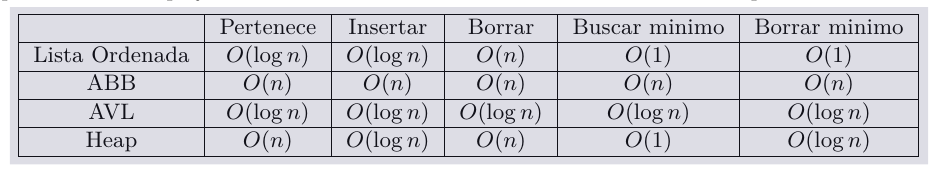

# TP2

# **Estructuras**

**Clase**: Berretacoin
|-  List<Bloque> bloques → cadena de bloques. solo se agrega al final y se accede al último bloque - O(1)
|- int[] saldos → se accede a los saldos directamente para reducir complejidad - O(1)
|- heap<UsuarioSaldo> maxTenedores → saldos ordenados de mayor a menor - O(log $n_b$)
→ a implementar: agregarBloque, hackearTx, etc

**Clase**: Bloque
|- List<Transaccion> transacciones → transacciones ordenadas por id - txUltimoBloque sería O($n_b$)
|- heap<Transaccion> maxPorMonto → transacciones ordenadas por monto, de acá se extrae hackearTx (la mayor) - O(log $n_b$) y txMayorValorUltimoBloque() *debería* ser O(1)
|- int sumaMontosNoCreacion → *
|- int cantidadNoCreacion → * con estas 2 se calcula el monto promedio sin tener que recorrer siempre la lista - O(1)

**Clase**: Transaccion
|- int id
|- int emisor
|- int receptor
|- int monto

→ tupla (id, e, r, m) donde debería poder compararse por montos (para ordenar el heap) y por id (para extraer cuál es el id de la de mayor txMayorValorUltimoBloque)

**Clase**: UsuarioSaldo
|- int usuario
|- int saldo

→ tupla de (u, s) donde se debería implementar como un comparador que sea un heap-max (??), así nos aseguramos que la raíz siempre es el máximo elemento (”cada nodo es **mayor o igual** que sus hijos”). creo que si hay empate de ids no se rompe la complejidad y sigue siendo O(1)

**Tabla de complejidades**

En heap, el máximo supongo que es O(1).

---

## Apuntes

[Apunte de la materia](https://github.com/blatth/uba-algo2/blob/main/Apuntes/AEDGen.pdf)

[**Teórica heaps**](https://github.com/blatth/uba-algo2/blob/main/Teoricas/Teorica9.pdf)

[**Teórica tries/hash**](https://github.com/blatth/uba-algo2/blob/main/Teoricas/Teorica10.pdf)

**Cormen:**

De estas definiciones de max-heap habría que implementar lo último: **max-heap-insert, max-heap-extract-max, max-heap-maximum,** todas O(log n)

